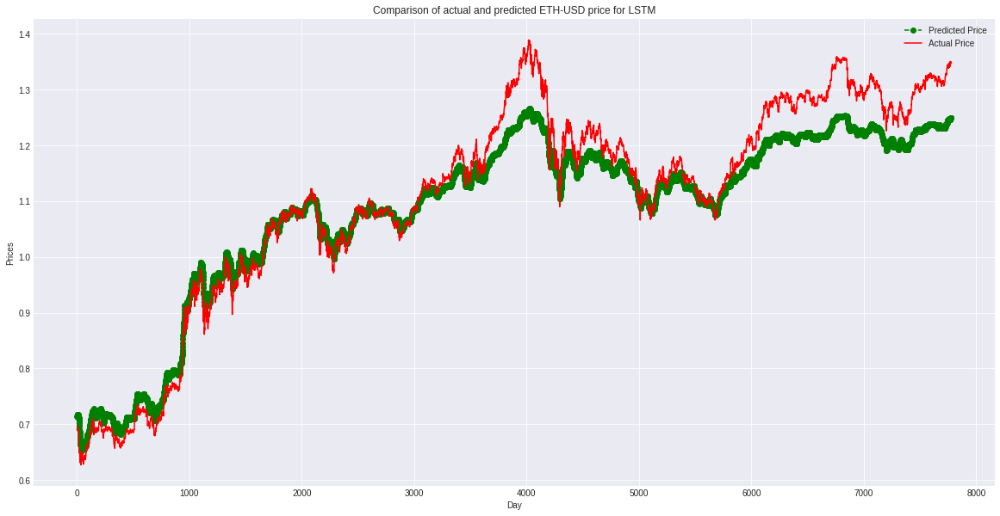
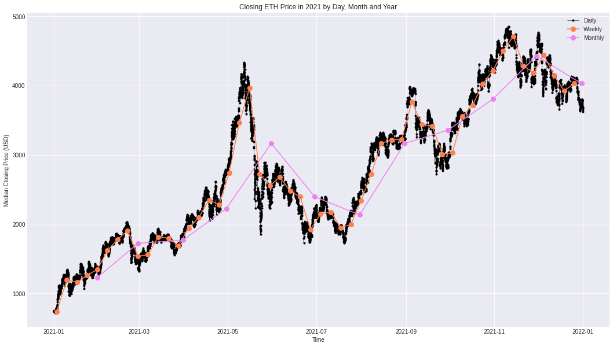
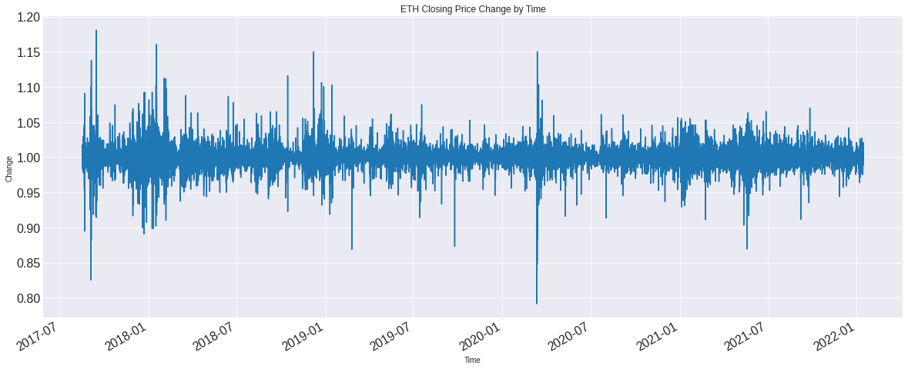

# ETH-USD Price Forcasting

Cryptocurrencies have become one of the most discussed internet talking points in recent years. It is believed that the top 20 cryptocurrencies make up nearly 90 percent of the total market. Ethereum or ETH is one of them. While various factors can influence the ETH price on the market, Ethereum price forecasting can be seen as a time-series problem. Using different machine learning models, I predict ETH prices on recent data in this project.

This repo contains data loading, data preprocessing, EDA, statistical tests, feature engineering, evaluation function, models, and deployment on recent data python scripts. Most importantly, a Jupyter Notebook that explains each step is attached to the project.

* Aggregated and cleaned five years of Ethereum price data and created training, validation, and holdout sets suitable for supervised learning.
* Performed exploratory data analysis and statistical tests to visualize and inspect trend, seasonality, and stationarity of observations.
* Created machine learning models such as XGBoost, LSTM, and CNN.

You can download the original dataset from [here](https://raw.githubusercontent.com/MoMkhani/ETH-USD-PriceForecasting/main/Data/Binance_ETHUSDT_1h.csv). The data is obtained from the "historical data" section of [cryptodatadownload.com](https://www.cryptodatadownload.com/data/apac/) which, provides crypto prices on different exchanges.

